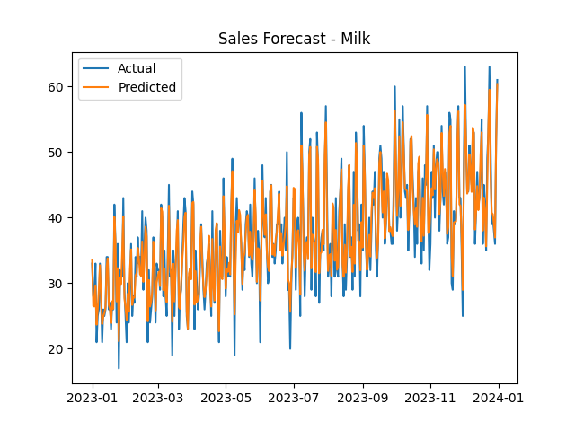

# 📊 Retail Sales Forecasting & Inventory Optimization System

## 🚀 Project Overview

This project builds a complete **Retail Analytics System** that predicts future sales and optimizes inventory levels using Machine Learning.

---

## ❓ Problem Statement

Retail businesses face:

* Stockouts → Lost sales
* Overstock → Increased cost

This system solves both using **data-driven forecasting & inventory optimization**.

---

## 🏢 Industry Relevance

Used by companies like:

* Amazon
* Walmart
* Flipkart
* Reliance Retail

---

## 💡 Business Value

* Improve demand forecasting
* Reduce inventory cost
* Prevent stockouts
* Increase profitability

---

## 🛠 Tech Stack

* Python
* Pandas, NumPy
* Scikit-learn (Random Forest)
* Matplotlib
* Streamlit

---

## ⚙️ Project Architecture

```
Data → Preprocessing → Feature Engineering → ML Model → Forecast → Inventory Optimization → Dashboard
```

---

## 📂 Folder Structure

```
Retail-Sales-Forecasting-Inventory-Optimization/
│
├── data/
├── src/
├── outputs/
├── images/
├── app/
├── main.py
├── README.md
```

---

## ▶️ How to Run

```bash
pip install -r requirements.txt
python src/data_generator.py
python main.py
streamlit run app/app.py
```

---

## 📊 Results

* Forecast graphs for multiple products
* Inventory optimization table
* Reorder alerts

---

## 📸 Screenshots



---

## 🔮 Future Improvements

* Multi-store forecasting
* Real-time dashboard
* Price optimization

---

## 👨‍💻 Author

Karthik B
